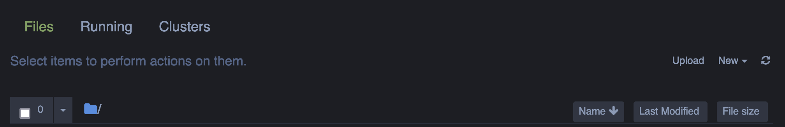

# Getting started

[Anaconda](https://docs.conda.io/projects/conda/en/latest/) is tool for managing coding environments. Without going into great detail, we all stand on the shoulders of giants and leverage the code that others have written to do specialized tasks in the form of packages.  One of the things Conda does is make sure these packages get installed in an orderly way. If you continue deeper into the forest of coding (beyond this class) you will find that sometimes the transitions between the versions of packages is not smooth, so it is helpful to work in a sandbox with specified versions where updating a package for one project doesn't affect the version specified in another (which might make the code break). 

The full Anaconda is very thorough, but also quite hefty (>3 GB), so instead we'll install its sleeker cousin, Miniconda (~400 MB). 
### Install & Setup an environment
1. Go [here](https://docs.conda.io/en/latest/miniconda.html) and download the version Miniconda that is appropriate for you.

2. Install, as per usual.  
_(For what it is worth, I saw an error at the end of my installation, but have yet to understand why because it works fine.)_

3. To create an environment for this class, open Terminal and type:
>`conda create --name geol_351 python=3.9`

### Activate
4. To activate that environment, type:
> `conda activate geol_351`

Great!  You should see [geol_351] prepended to the command line prompt. In future, before you start working, activate the environment by using the prompt above (for step 4). 

### Packages
Now it's time to install packages.  You only need to do this once in each environment, so you won't have to reinstall these packages each time you activate the environment. 

To install a package, type:
>`conda install [package name without brackets]`

For each package, Conda will assess what the install list will be and the size of the packages (so the package you specified and any dependencies of that package), and ask you to confirm that it is ok to install the required list. If you agree type "y" and press enter.

Packages to install (for now):
- pandas
- seaborn
- jupyter notebook

### Booting up Jupyter Notebook
Use terminal to navigate to the directory for your GEOL 351 coursework. 

Type: 
>`jupyter notebook`

A browser window should automatically open and show you a screen with a header like this:

